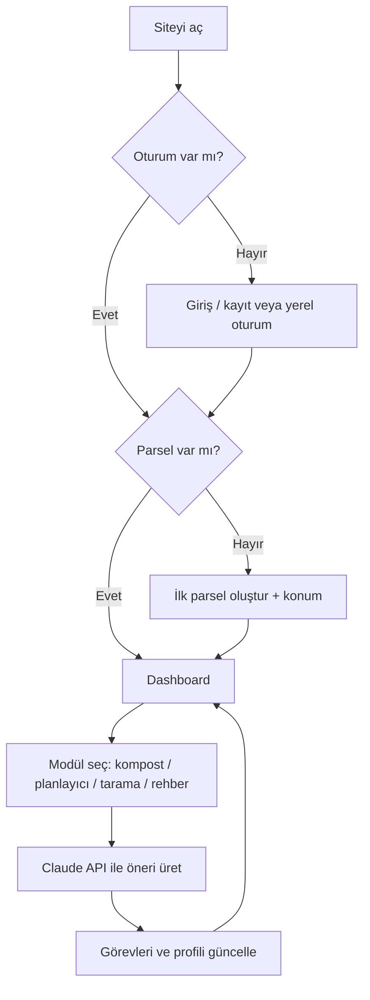

# User flow — SoilSense AI

Adım adım akış (değerlendirme için). İsteğe bağlı görsel özet aşağıdaki diyagramdadır.

## 1) Uygulamaya giriş

- Kullanıcı yayın linkini açar ([Netlify](https://soilsensee.netlify.app/)).
- İsteğe bağlı uzaktan auth açıksa e-posta ile giriş / kayıt; aksi halde yerel oturum akışı.

## 2) İlk kurulum

- İlk parsel (field) oluşturulur: ad, toprak tipi, alan büyüklüğü, adres veya koordinat.
- Konum doğrulanır (kara / su kontrolü); profil verisi alan bazında saklanır.

## 3) Ana panel (dashboard)

- Hava ve konum özeti, günlük içgörü ve görevler.
- **Claude** destekli analiz motoru girdileri değerlendirir; toprak iyileştirme, kompost ve üretim odaklı öneriler üretilir.
- Toprak canlılık skoru ve öneriler (LLM + yerel fallback mantığı).

## 4) Modüller

- **Kompost sihirbazı:** Atık/envanter bilgisine göre reçete önerisi (Claude).
- **Tarla planlayıcı:** Ürün seçimleri, uyumluluk ve güvenlik uyarıları.
- **Bitki taraması:** Görüntü + metin bağlamı ile yorum (Claude).
- **Rehber / tur:** Ürün içi yönlendirme ve eğitim içeriği.

## 5) Döngü

- Kullanıcı aktivite ve görevleri günceller; yeni veri ile öneriler yenilenir.
- Dil değiştirilebilir (i18n).

---

## Akış diyagramı (özet)

